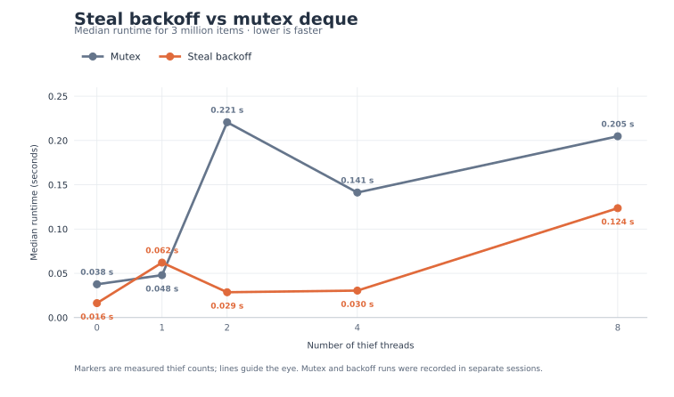

# Performance: from the baseline to steal backoff

The chart compares the mutex deque, the original sequentially consistent
lock-free deque, the lock-free deque after cache-line separation, and the
latest lock-free deque with bounded steal backoff. Each bar is a median runtime
for processing 3,000,000 items; lower is faster. Panels use separate time
scales to keep the small bars readable.


| Thieves | Mutex (s) | Sequential consistency (s) | Cache layout (s) | Steal backoff (s) |
| ---: | ---: | ---: | ---: | ---: |
| 0 | 0.037648 | 0.015674 | 0.015835 | 0.016345 |
| 1 | 0.047940 | 0.130083 | 0.070263 | 0.062108 |
| 2 | 0.220591 | 0.205776 | 0.094790 | 0.028637 |
| 4 | 0.141232 | 0.508049 | 0.318180 | 0.030491 |
| 8 | 0.204754 | 0.890590 | 0.687449 | 0.123559 |

Steal backoff has the lowest saved median at two, four, and eight thieves.
The mutex deque has the lowest median at one thief. With no thieves, the three
lock-free variants are close together; the mutex deque takes roughly twice as
long. The small differences among the lock-free variants at zero thieves
should not be read as a meaningful ranking.

## Final version versus mutex

The line graph compares the newest backoff variant with the mutex deque.
Its points use the same saved medians as the table above.



At two, four, and eight thieves, the final version took 87.0%, 78.4%, and
39.7% less time than the saved mutex medians. At one thief it took 29.6% more
time. With no thieves it took 56.6% less time, though that owner-only workload
does not exercise stealing or backoff. The mutex measurements are historical
and were not paired with the final backoff runs. The connecting lines guide
the eye between the five measured thief counts; they do not represent
additional measurements.

## How the implementation evolved

**Sequential consistency established the baseline.** The original lock-free
deque used sequentially consistent atomic operations throughout. The
[baseline comparison](benchmark-results/2026-09-25-seq-cst-baseline/README.md)
also measured the mutex deque. At four and eight thieves, the SC lock-free
median was 0.508 and 0.891 seconds, compared with mutex medians of 0.144 and
0.206 seconds in that same baseline. This identified the multi-thief workload
as the main performance problem, without identifying its cause.

**Stage 1 changed memory ordering.** Owner-only loads became relaxed, while
pool record return and claim became release and acquire operations. Deque
publication, thief snapshots, top arbitration, and slot accesses stayed
sequentially consistent. In a same-machine alternating comparison, this was
24.9% faster with one thief and 50.1% faster with two, but 14.2% slower with
four and 2.8% slower with eight. The four-thief timing also varied between
protocols, so the [Stage 1 report](benchmark-results/weaker-orders-stage-1/README.md)
did not establish a broad performance gain.

**Cache-line separation reduced false sharing.** The next change placed the
active array pointer, owner bottom index, thief top index, and cached top on
separate cache lines. On this Apple ARM64 host the deque grew from 48 to 512
bytes. In the [paired cache-layout experiment](benchmark-results/2026-09-26-cache-layout-p1/README.md),
the padded version reduced median time by 24.7%, 37.8%, 37.7%, and 22.2% at
one, two, four, and eight thieves. Its zero-thief result changed by only
-0.7%. The larger object is a space cost for this layout.

**Profiling pointed to contention among thieves.** After the layout change,
the [September 28 profile review](benchmark-results/2026-09-28-profile-review/README.md)
still placed about 70% of four-thief and 79% of eight-thief sampled thief CPU
delta at the instruction following the top compare/exchange. A separate
instrumented diagnostic found median `ABORT` results per success of 2.27 with
four thieves and 4.73 with eight. Those counts include all raw `ABORT` paths,
and the samples do not measure exact CAS latency. Together they motivated a
bounded retry policy around `steal()` rather than another layout change.

**Worker-local backoff reduced multi-thief time.** Each worker now owns its
retry context. The default policy makes at most four fresh steal attempts per
call; after an actual `ABORT`, it grows a jitter window from 4 pause units up
to 256. A success or genuine empty result resets the window. The raw deque
algorithm and its memory orders are unchanged. In the [paired backoff run](benchmark-results/2026-09-29-steal-backoff/README.md),
median time fell by 70.8%, 90.7%, and 81.8% against the no-backoff reference
at two, four, and eight thieves. Backoff was faster in all ten pairs at each
of those counts. At zero and one thief the median changes were only 0.2% and
5.3%, with 3/10 and 6/10 faster pairs; the data do not establish a reliable
benefit there. All 100 measured runs passed exact-once validation.

The backoff tests and ThreadSanitizer checks passed. A separate
[bounded GenMC model](model/README.md) explored 23,764 RC11 executions of
Stage 1 ordering with steal retries without errors. Its smaller retry bound
checks safety schedules, not the runtime or fairness of the pause policy.

## Measurement method and sources

The benchmark has one owner pushing items while thieves steal. After the
thieves join, the owner drains any remainder. Worker setup and exact-once
validation are outside the timed interval; worker completion and result
recording are inside it. The saved runs used Apple Clang 17 on the same macOS
ARM64 host and optimized `-std=c++26 -O3 -DNDEBUG` builds. Each source below
reports ten measured trials per thief count, excluding warm-ups:

| Chart series | Saved median source |
| --- | --- |
| Mutex | [Stage 1 comparison](benchmark-results/weaker-orders-stage-1/summary.csv), `mutex_median_seconds` |
| Sequential consistency | [SC baseline](benchmark-results/2026-09-25-seq-cst-baseline/summary.csv), `lock_free_median_seconds` |
| Cache layout | [P1 cache-layout candidate](benchmark-results/2026-09-26-cache-layout-p1/summary.csv), `candidate_median_seconds` |
| Steal backoff | [Backoff candidate](benchmark-results/2026-09-29-steal-backoff/summary.csv), `candidate_median_seconds` |

## Benchmark limitations

- **The four-way and two-line charts combine recording sessions.** The mutex
  implementation was not rebenchmarked alongside backoff. Even on the same
  machine, scheduling and background load can change between sessions. The
  paired cache-layout and backoff experiments support claims about those
  individual changes more directly; small cross-session gaps do not.
- **The workload uses one deque and one owner.** The owner pushes while
  thieves steal, then drains after they have joined. It does not measure
  concurrent owner pops, a scheduler with many deques or changing victims,
  or repeated shrink and buffer reuse under concurrent steals.
- **The timer measures the whole workload.** It includes worker completion
  and storing stolen values into per-thread vectors, so these medians are not
  isolated `steal()` latencies. The one-thief profile found result recording
  prominent in sampled CPU time. Worker setup and exact-once validation are
  excluded from the timer.
- **The evidence is specific to this machine and run size.** The measurements
  cover 3,000,000 items and 0, 1, 2, 4, or 8 thieves on one Apple ARM64 host.
  Ten-trial medians hide some run-to-run spread; the source `raw.csv` files
  and per-experiment reports show individual timings and ranges. The charts
  do not establish performance on x86-64 or for other queue occupancies.
- **Throughput is only one outcome.** These runs do not measure per-task
  latency, fairness across thieves, energy use, or the pause policy's CPU
  cost in a complete scheduler. Profiling samples and instrumented `ABORT`
  counts helped select an experiment, but they are not direct measurements
  of CAS latency or the uninstrumented policy's speedup.

The [bar chart PNG](benchmark-results/implementation-comparison.png) and
[line graph PNG](benchmark-results/final-vs-mutex.png) are also available.
Regenerate all four chart files from the saved CSVs with
[`benchmarks/plot_implementation_comparison.py`](benchmarks/plot_implementation_comparison.py):

```sh
python3 -m pip install --target build/plot_deps matplotlib
PYTHONPATH=build/plot_deps MPLCONFIGDIR=build/mpl_config XDG_CACHE_HOME=build/font_cache python3 benchmarks/plot_implementation_comparison.py
```
